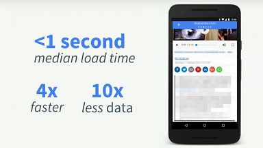
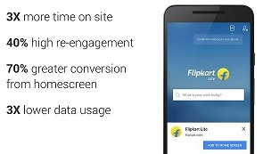
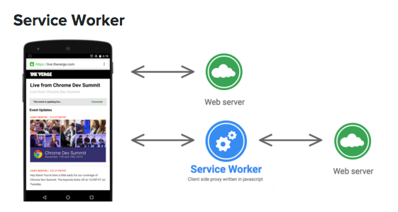

<!--  -->

# Easy Progressive Web Apps

Easy way to transform **ANY** web page or application into a Progressive Web App (PWA). 

Progressive Web App are difficult to code and debug: their API uses multithreading and websockets. There are options on the open source comunity that helps, like *sw-precache* form Google, but they generate hard to undertand and modificate code. 

In software engineering simplicity is very important. The aim of this project is simplify the process of creating or migrating any web page or application to a Progressive Web App. It is a foundation on wich more functionality can be added. 

*(for Chrome desktop and mobile at the moment*).

> PWAs enable the paradigm of **one code base for all platforms** (desktop, IOS, Android, Windows Phone, etc.) This is a very efficient and low-cost software development process for the enterprise. It avoids the current and ineficient platform fragmentation. Besides, PWAs are very appropiated for mobile because they recover automatically form desconexions in bad network conditions (between other benefits)
>
> More info at [Chrome Dev Summit 20106](https://www.youtube.com/watch?v=eI3B6x0fw9s&feature=youtu.be&t=14m3s)

## Demo

#### <a href="https://yagolopez.github.io/progressive-web-app-boilerplate/" target=_blank>Open</a> →

## Summary of benefits

- Much lower cost of development and manteinance: there is only one code base for all platforms (mobile, web, desktop)

- Much better metrics: around 70% of conversions, for example.

- Turns any web site into an application easily, with offline capabilities

- Great user experience: fast navigation and native feeling

- Installation by one click and updates without app stores intermediation.

- Easy way to push notifications

- Indexed by search engines: better discoverability and SEO

- Lower data traffic: great for mobile.

<!--

|                 Image 1                  |                 Image 2                  |
| :--------------------------------------: | :--------------------------------------: |
|  |  |

-->

## Elements needed for a Progressive Web App

- `manifest.json`: a file containing configuration metadata (app icon, app name, etc.). It enables app installation.
- `Service worker`: javascript file to cache assets (html, css, fonts, images...) and/or receive notifications.
  - Definition: a service worker is a javascript file that runs in the background and works like a proxy server. It is able to intercept requests and decide if respond from cache memory or from network.
  - Browsers that don’t support them can just use the app online in the normal expected fashion.

  

## Requirements

- Chrome for desktop or mobile (Probably it works on the latest Opera and FireFox versions, not tested)
- IMPORTANT: Service workers need to be served through **https** protocol or localhost during development (Not working with local network intranet addresses or names, keep this in mind).

## Use

- Copy `manifes.json` and `sw.js` into the ***project root***
- Configure `manifes.json` with values suited to the project: *app name, path to icon, etc.*
  - In `sw.js` → `filesToCache` *array*, add the paths to the files that must be cached for offline use. (these files are also called "app shell")
- Install the app in home screen:
  - In Chrome for **desktop**: right upper menu → "More tools" → "Add to desktop"
  - In Chrome for **mobile**: right upper menu → "Add to home screen"
- Disconnect form network and reload the app
- Note: in offline mode some errors may appear in console, you can ignore it. This do not prevent the right execution of the service worker.

## To do

- Push notifications

## References

- [https://www.geekmj.org/insights/progressive-web-app-introduction-599/](https://www.geekmj.org/insights/progressive-web-app-introduction-599/)
- [https://developer.mozilla.org/en-US/docs/Web/API/Service_Worker_API/Using_Service_Workers](https://developer.mozilla.org/en-US/docs/Web/API/Service_Worker_API/Using_Service_Workers)

<a href="#">Back to start </a> ↑
